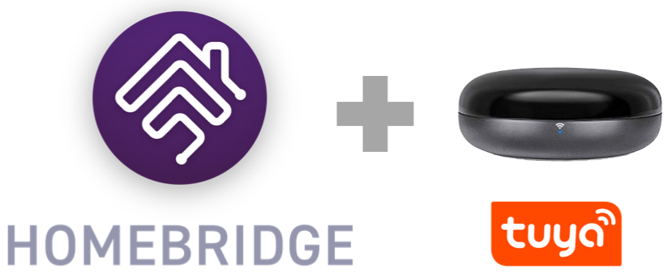
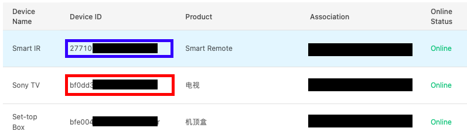
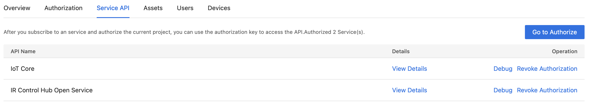

<p align="center">



</p>

# Homebridge Tuya IR
[](https://www.npmjs.com/package/homebridge-tuya-ir)

[](https://www.npmjs.com/package/homebridge-tuya-ir)


Control your Tuya Smart IR based devices in HomeKit. Also works with Smart Home IR Blaster. You can add multiple Smart IR device to single configuration.

## Supported Devices
* Air Conditioner (Only pre-configured vendor. No DIY devices)
* Fan (Pre-configured and DIY devices)
* All other Pre-configured remotes will be added as switch to turn them on and off only. No other feature. (No DIY devices)

## Installation Instructions

#### Option 1: Install via Homebridge Config UI X:

Search for "Tuya IR" in [homebridge-config-ui-x](https://github.com/oznu/homebridge-config-ui-x) and install `homebridge-tuya-ir`.

#### Option 2: Manually Install:

```
sudo npm install -g homebridge-tuya-ir
```
## Add Smart IR and Remotes
Download Tuya Smart app and add your Smart IR device based on OEM documentation and add remotes you want to control using the Smart IR device.

## Create Tuya IoT Project
* Follow steps on [Tuya website](https://developer.tuya.com/en/docs/iot/Platform_Configuration_smarthome?id=Kamcgamwoevrx) to create your Tuya Cloud project and assign your devices to the project.
* Login to your Tuya IoT account and open the project. Each remote is shown as separate device.
* The Smart IR device will also be shown as a separate device.
* Copy the device ID for Smart IR and remotes as shown in the image below. You will need to these to configure the plugin.



## Authorization
> Tuya IoT Platform
You need to attach multiple services to your Tuya IOT project.
1. Search for "IR Control Hub Open Service" in Tuya IoT Platform Service
2. Subscribe to the service, authorize the project you are working on.

Repeat the steps for all the services in the following image


## Configuration
> UI

1. Navigate to the Plugins page in [homebridge-config-ui-x](https://github.com/oznu/homebridge-config-ui-x).
2. Click the **Settings** button for the Tuya IR plugin.
3. Add your devices
4. Add device parameters
5. Restart Homebridge for the changes to take effect.

> Manual

1. Edit the config.json file to add your devices and parameters. 
2. Restart Homebridge

## Known Issues

1. Tuya API doesn't always return devices added to Smart IR based on OEM hardware. Thus, you need to add them in your app and then provide IDs in the plugin configuration. This is configuruable in the configuration.

## Contributing

If you have new accessory logic for a new device, please add a function defined by manufacturer, and describe your changes in the readME file.

## Donating

Please donate to a local pet shelter, or food pantry. It's been a wild time, but we can do our part by helping others. 
